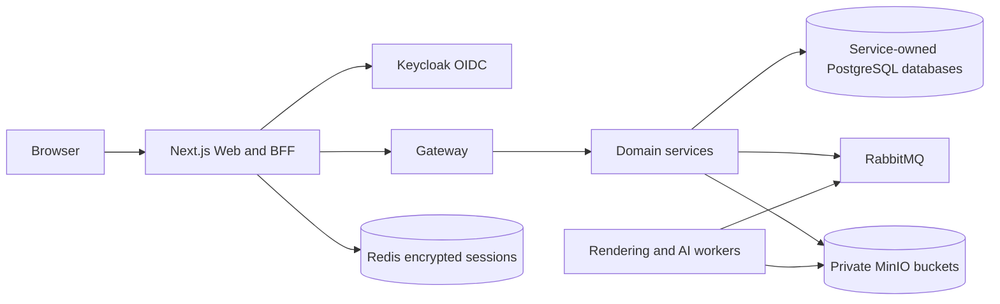

# Architecture InvitaFlow

Version: 1.0
Status: Living document
Last updated: 2026-10-07
Owner: FOCUS HD ENTREPRISES
Product: InvitaFlow
Implementation status: **IMPLEMENTED**

InvitaFlow est un monorepo pnpm piloté par Turborepo. Le navigateur utilise Next.js `apps/web`, qui assure également les routes BFF. Les requêtes API passent par Gateway NestJS/Fastify vers des services de domaine NestJS. Ceux-ci possèdent des schémas et bases PostgreSQL séparés. RabbitMQ distribue les tâches et événements, Redis porte notamment les sessions serveur, et MinIO stocke les médias et documents générés.

## Services actifs repérés

Profile, Events, Guests, Seating, Designs, Media, AI Design, Billing, Payments, Wallet, Notifications, Invitations/Rendering, Audit et Analytics. `services/access` existe aussi mais son rôle utilisateur/opérationnel doit être considéré selon ses routes/config effectives avant exposition. `apps/admin` fournit le shell admin; consoles métier sont dans Web.

## Flux et frontières

Le navigateur reçoit un cookie opaque HttpOnly et n’est pas le propriétaire d’un bearer token de session BFF. Gateway relaie l’accès vers les APIs. Les services valident l’identité et la propriété; les opérations interservices utilisent des jetons dédiés ou tokens internes selon les routes. Outbox en base métier vers RabbitMQ évite l’écart transaction/message lorsque cette voie est implémentée.

## Infrastructure locale

`compose.yaml` décrit PostgreSQL, Redis, RabbitMQ, Keycloak, Mailpit, MinIO, Gateway, applications et workers. Traefik, ClamAV et le profil d’observabilité sont des composants configurés. Compose est une stack de développement local et ne vaut pas configuration de production.

## Sources

`README.md`, `compose.yaml`, `apps/gateway/src/main.ts`, contrôleurs, modules, `infrastructure/` et `services/*/prisma/schema.prisma`.
