# Architecture diagrams

Version: 1.0
Status: Living document
Last updated: 2026-10-07
Owner: FOCUS HD ENTREPRISES
Product: InvitaFlow

Chaque diagramme est indépendant : Mermaid éditable dans `sources/`, export SVG et PNG. SVG/PNG sont generated with a small deterministic renderer from the node/edge model; they preserve the communication path but do not execute Mermaid CLI. Mermaid sources are the editable source of truth.

## Contexte système

Source: [`system-context.mmd`](diagrams/sources/system-context.mmd) · [`SVG`](diagrams/svg/system-context.svg) · [`PNG`](diagrams/png/system-context.png)

## C4 conteneurs

Source: [`c4-containers.mmd`](diagrams/sources/c4-containers.mmd) · [`SVG`](diagrams/svg/c4-containers.svg) · [`PNG`](diagrams/png/c4-containers.png)

## Composants

Source: [`component-architecture.mmd`](diagrams/sources/component-architecture.mmd) · [`SVG`](diagrams/svg/component-architecture.svg) · [`PNG`](diagrams/png/component-architecture.png)

## Déploiement logique

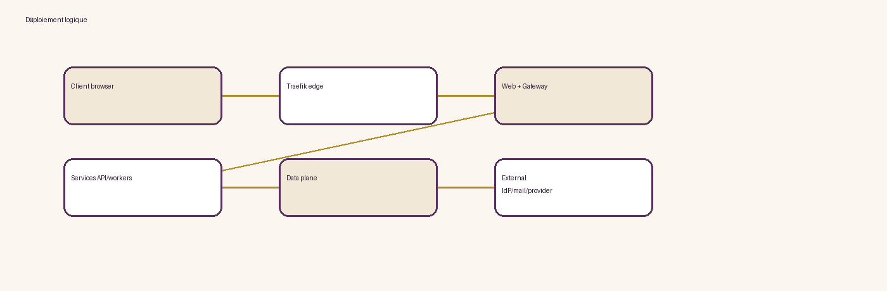

Source: [`deployment.mmd`](diagrams/sources/deployment.mmd) · [`SVG`](diagrams/svg/deployment.svg) · [`PNG`](diagrams/png/deployment.png)

## Frontières de confiance

Source: [`network-trust-boundary.mmd`](diagrams/sources/network-trust-boundary.mmd) · [`SVG`](diagrams/svg/network-trust-boundary.svg) · [`PNG`](diagrams/png/network-trust-boundary.png)

## Authentification OIDC

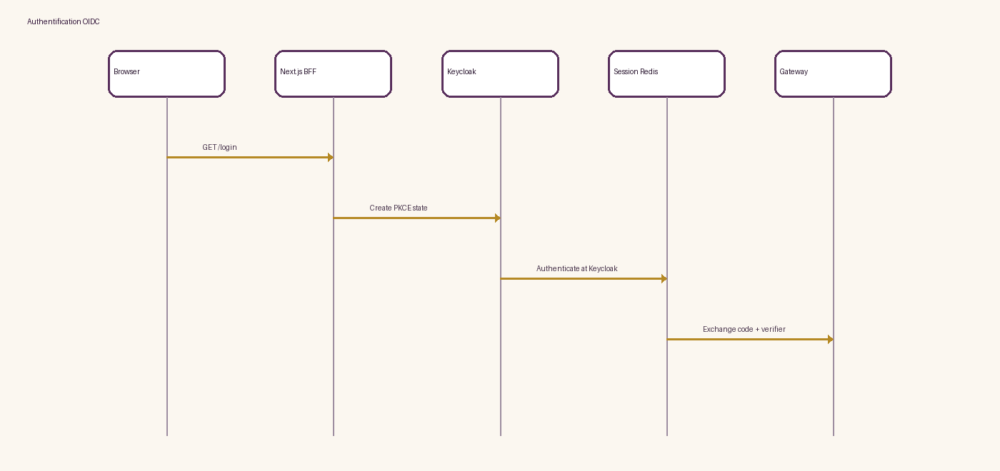

Source: [`authentication-sequence.mmd`](diagrams/sources/authentication-sequence.mmd) · [`SVG`](diagrams/svg/authentication-sequence.svg) · [`PNG`](diagrams/png/authentication-sequence.png)

## Inscription et acceptation légale

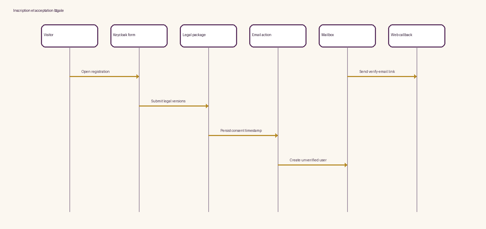

Source: [`registration-legal-acceptance.mmd`](diagrams/sources/registration-legal-acceptance.mmd) · [`SVG`](diagrams/svg/registration-legal-acceptance.svg) · [`PNG`](diagrams/png/registration-legal-acceptance.png)

## Vérification email

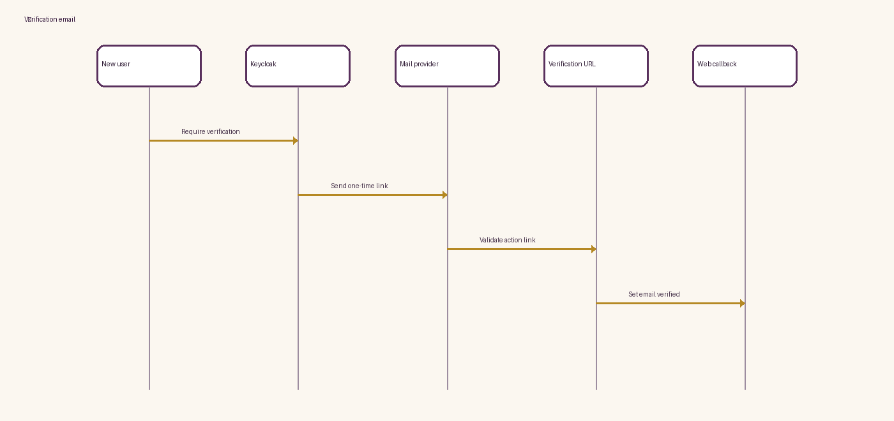

Source: [`email-verification-sequence.mmd`](diagrams/sources/email-verification-sequence.mmd) · [`SVG`](diagrams/svg/email-verification-sequence.svg) · [`PNG`](diagrams/png/email-verification-sequence.png)

## Réinitialisation mot de passe

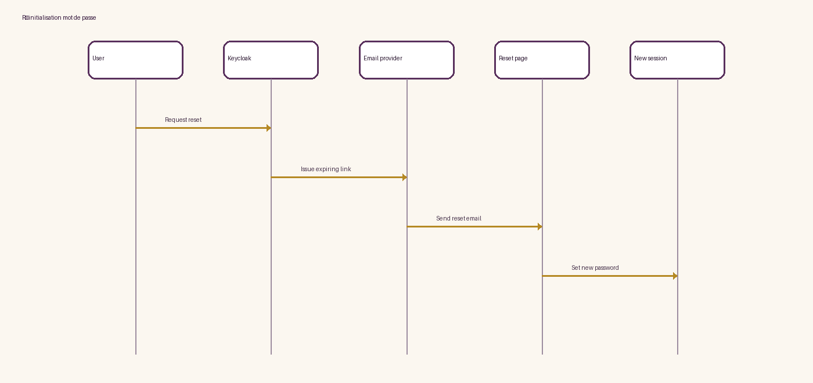

Source: [`password-reset-sequence.mmd`](diagrams/sources/password-reset-sequence.mmd) · [`SVG`](diagrams/svg/password-reset-sequence.svg) · [`PNG`](diagrams/png/password-reset-sequence.png)

## Création événement

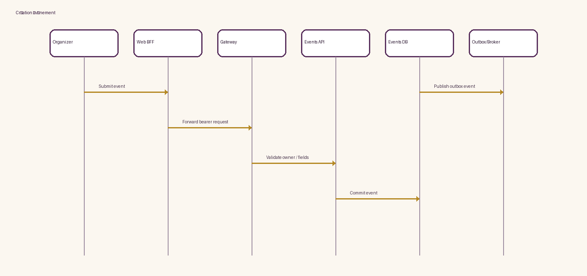

Source: [`event-creation-sequence.mmd`](diagrams/sources/event-creation-sequence.mmd) · [`SVG`](diagrams/svg/event-creation-sequence.svg) · [`PNG`](diagrams/png/event-creation-sequence.png)

## Import invités

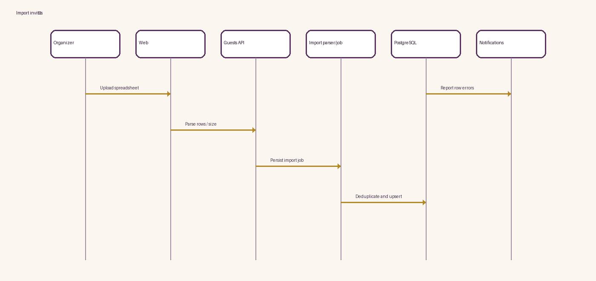

Source: [`guest-import-sequence.mmd`](diagrams/sources/guest-import-sequence.mmd) · [`SVG`](diagrams/svg/guest-import-sequence.svg) · [`PNG`](diagrams/png/guest-import-sequence.png)

## Génération invitation

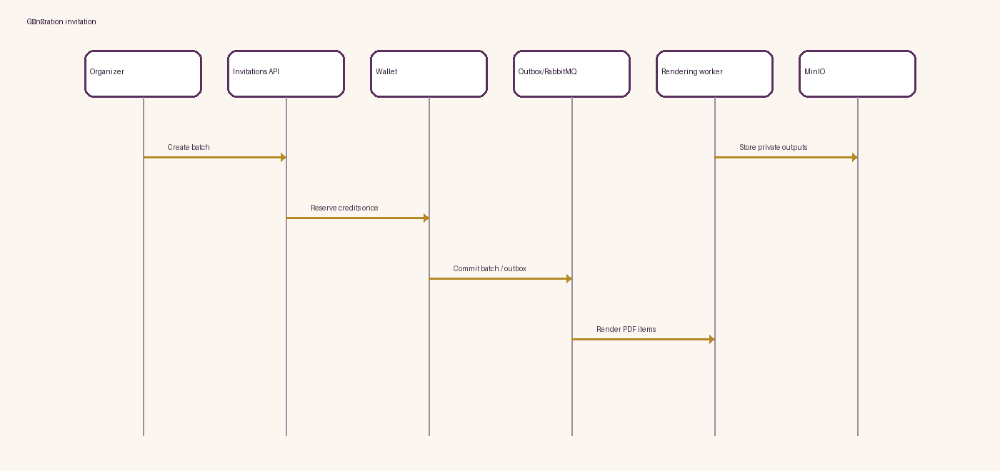

Source: [`invitation-generation-sequence.mmd`](diagrams/sources/invitation-generation-sequence.mmd) · [`SVG`](diagrams/svg/invitation-generation-sequence.svg) · [`PNG`](diagrams/png/invitation-generation-sequence.png)

## Pipeline rendu design

Source: [`design-document-rendering-pipeline.mmd`](diagrams/sources/design-document-rendering-pipeline.mmd) · [`SVG`](diagrams/svg/design-document-rendering-pipeline.svg) · [`PNG`](diagrams/png/design-document-rendering-pipeline.png)

## PDF/ZIP batch

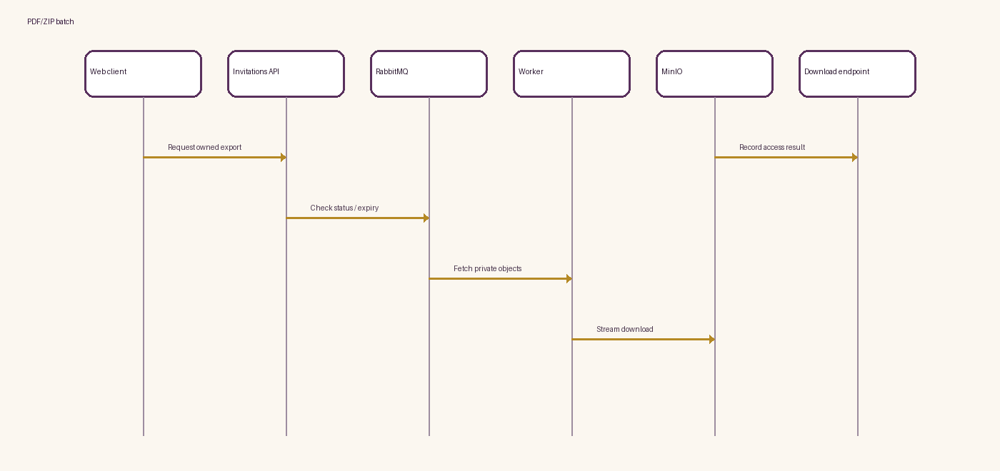

Source: [`pdf-zip-generation-sequence.mmd`](diagrams/sources/pdf-zip-generation-sequence.mmd) · [`SVG`](diagrams/svg/pdf-zip-generation-sequence.svg) · [`PNG`](diagrams/png/pdf-zip-generation-sequence.png)

## RSVP public

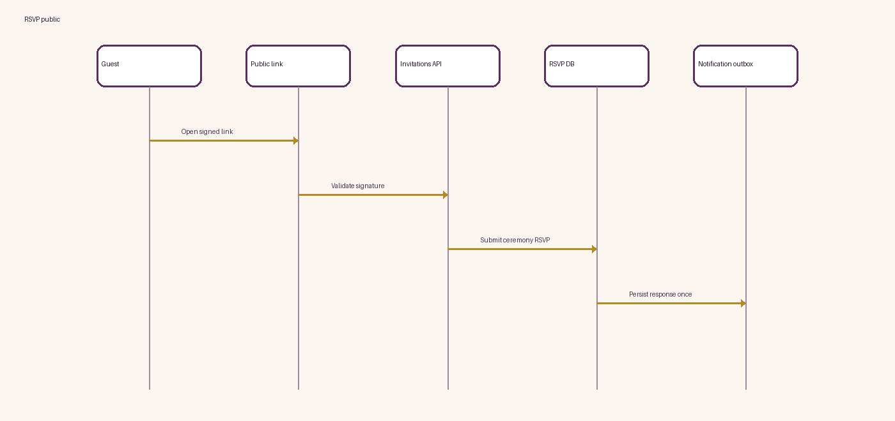

Source: [`rsvp-sequence.mmd`](diagrams/sources/rsvp-sequence.mmd) · [`SVG`](diagrams/svg/rsvp-sequence.svg) · [`PNG`](diagrams/png/rsvp-sequence.png)

## QR signé

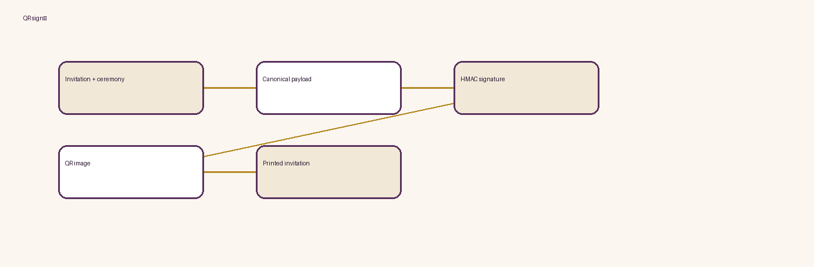

Source: [`qr-generation-sequence.mmd`](diagrams/sources/qr-generation-sequence.mmd) · [`SVG`](diagrams/svg/qr-generation-sequence.svg) · [`PNG`](diagrams/png/qr-generation-sequence.png)

## Check-in

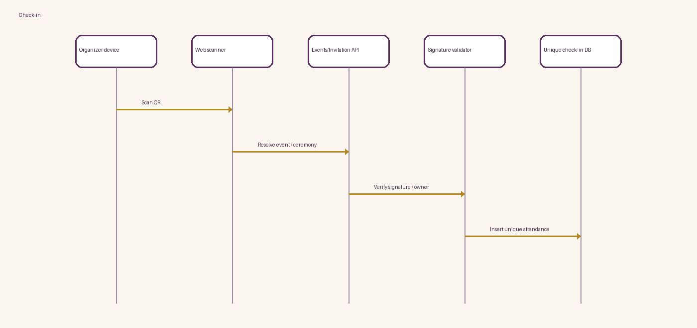

Source: [`check-in-sequence.mmd`](diagrams/sources/check-in-sequence.mmd) · [`SVG`](diagrams/svg/check-in-sequence.svg) · [`PNG`](diagrams/png/check-in-sequence.png)

## Prévention double check-in

Source: [`anti-double-entry.mmd`](diagrams/sources/anti-double-entry.mmd) · [`SVG`](diagrams/svg/anti-double-entry.svg) · [`PNG`](diagrams/png/anti-double-entry.png)

## Checkout paiement

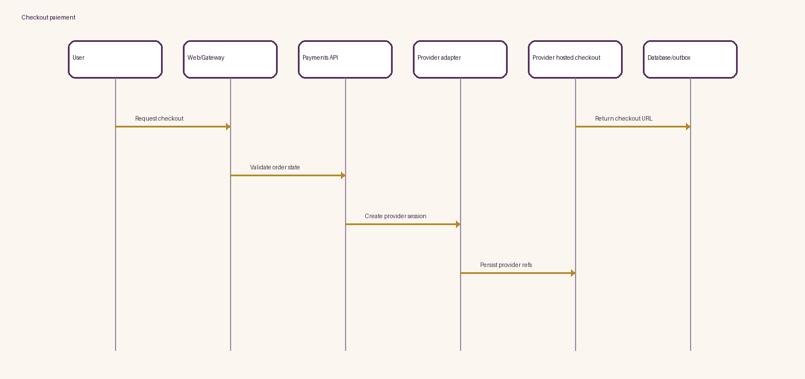

Source: [`payment-checkout-sequence.mmd`](diagrams/sources/payment-checkout-sequence.mmd) · [`SVG`](diagrams/svg/payment-checkout-sequence.svg) · [`PNG`](diagrams/png/payment-checkout-sequence.png)

## Callback fournisseur (à valider)

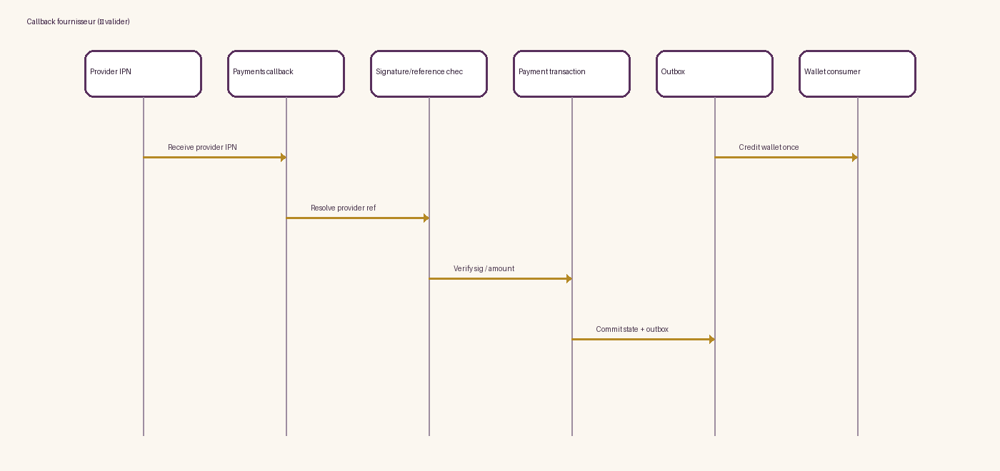

Source: [`easypay-ipn-sequence.mmd`](diagrams/sources/easypay-ipn-sequence.mmd) · [`SVG`](diagrams/svg/easypay-ipn-sequence.svg) · [`PNG`](diagrams/png/easypay-ipn-sequence.png)

## Idempotence paiement

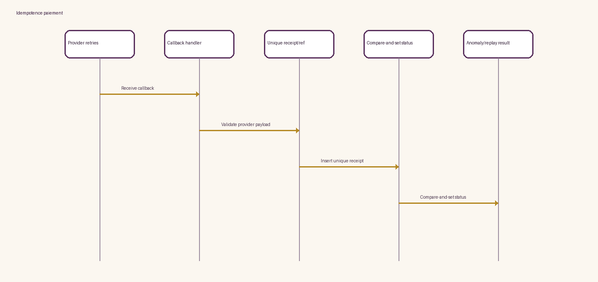

Source: [`payment-idempotency-sequence.mmd`](diagrams/sources/payment-idempotency-sequence.mmd) · [`SVG`](diagrams/svg/payment-idempotency-sequence.svg) · [`PNG`](diagrams/png/payment-idempotency-sequence.png)

## Crédit Wallet

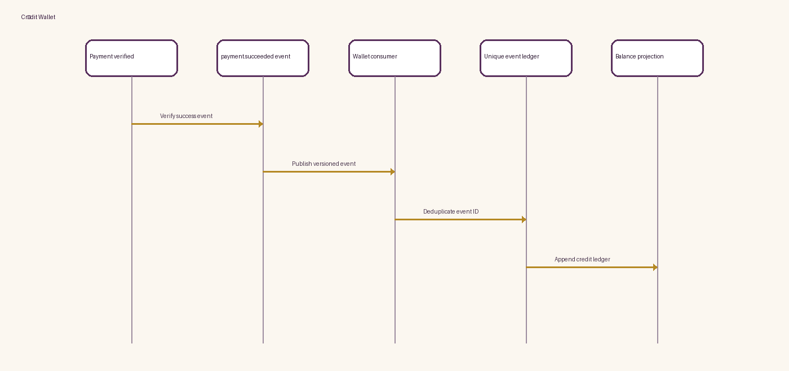

Source: [`wallet-credit-sequence.mmd`](diagrams/sources/wallet-credit-sequence.mmd) · [`SVG`](diagrams/svg/wallet-credit-sequence.svg) · [`PNG`](diagrams/png/wallet-credit-sequence.png)

## Flux agence

Source: [`agency-flow.mmd`](diagrams/sources/agency-flow.mmd) · [`SVG`](diagrams/svg/agency-flow.svg) · [`PNG`](diagrams/png/agency-flow.png)

## Flux partenaire

Source: [`partner-flow.mmd`](diagrams/sources/partner-flow.mmd) · [`SVG`](diagrams/svg/partner-flow.svg) · [`PNG`](diagrams/png/partner-flow.png)

## Upload média sécurisé

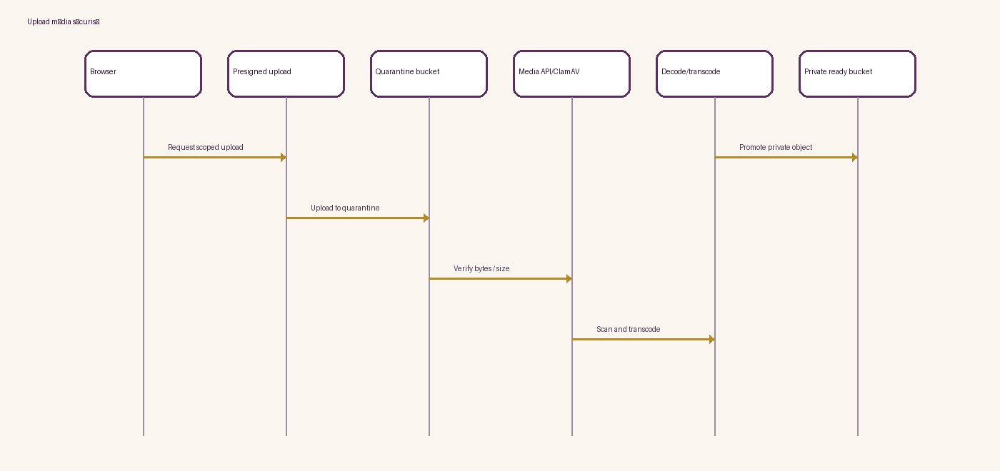

Source: [`media-upload-storage-sequence.mmd`](diagrams/sources/media-upload-storage-sequence.mmd) · [`SVG`](diagrams/svg/media-upload-storage-sequence.svg) · [`PNG`](diagrams/png/media-upload-storage-sequence.png)

## AI Design Composer

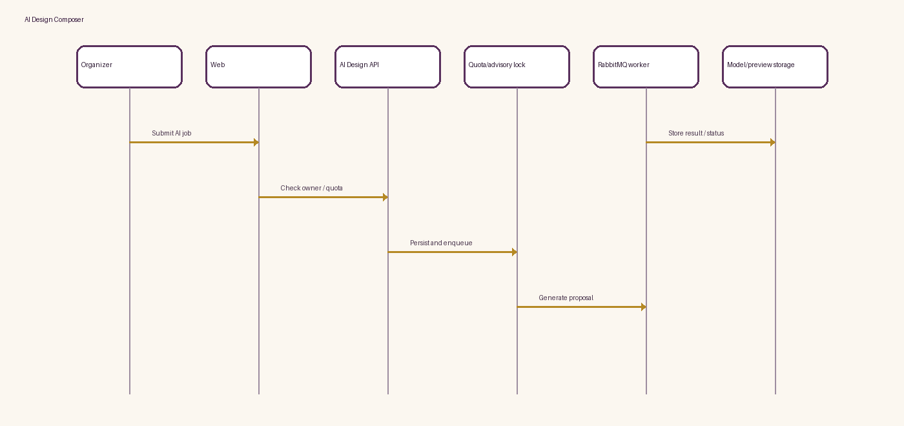

Source: [`ai-design-composer-sequence.mmd`](diagrams/sources/ai-design-composer-sequence.mmd) · [`SVG`](diagrams/svg/ai-design-composer-sequence.svg) · [`PNG`](diagrams/png/ai-design-composer-sequence.png)

## ERD haut niveau

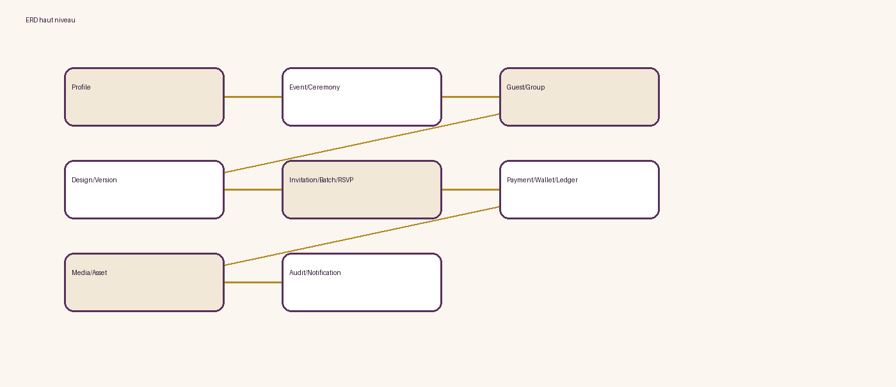

Source: [`erd-high-level.mmd`](diagrams/sources/erd-high-level.mmd) · [`SVG`](diagrams/svg/erd-high-level.svg) · [`PNG`](diagrams/png/erd-high-level.png)

## Machine paiement

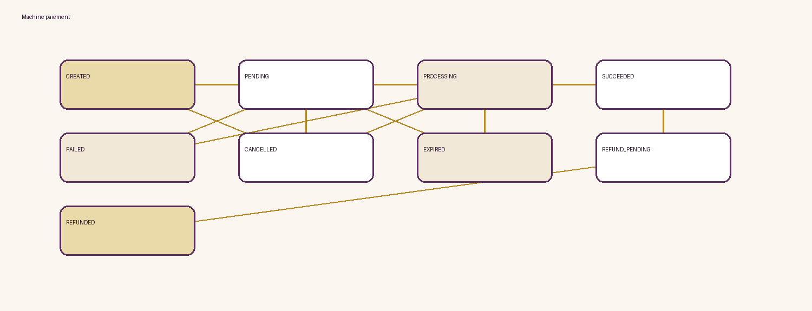

Source: [`payment-state-machine.mmd`](diagrams/sources/payment-state-machine.mmd) · [`SVG`](diagrams/svg/payment-state-machine.svg) · [`PNG`](diagrams/png/payment-state-machine.png)

## Machine invitation batch

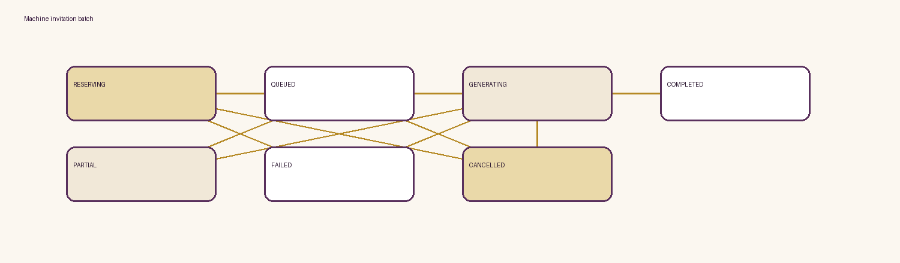

Source: [`invitation-state-machine.mmd`](diagrams/sources/invitation-state-machine.mmd) · [`SVG`](diagrams/svg/invitation-state-machine.svg) · [`PNG`](diagrams/png/invitation-state-machine.png)

## Cycle événement

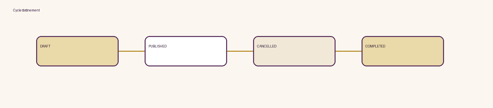

Source: [`event-domain-lifecycle.mmd`](diagrams/sources/event-domain-lifecycle.mmd) · [`SVG`](diagrams/svg/event-domain-lifecycle.svg) · [`PNG`](diagrams/png/event-domain-lifecycle.png)

## Sauvegarde et restauration

Source: [`backup-restore-architecture.mmd`](diagrams/sources/backup-restore-architecture.mmd) · [`SVG`](diagrams/svg/backup-restore-architecture.svg) · [`PNG`](diagrams/png/backup-restore-architecture.png)

## Observabilité

Source: [`observability-architecture.mmd`](diagrams/sources/observability-architecture.mmd) · [`SVG`](diagrams/svg/observability-architecture.svg) · [`PNG`](diagrams/png/observability-architecture.png)
